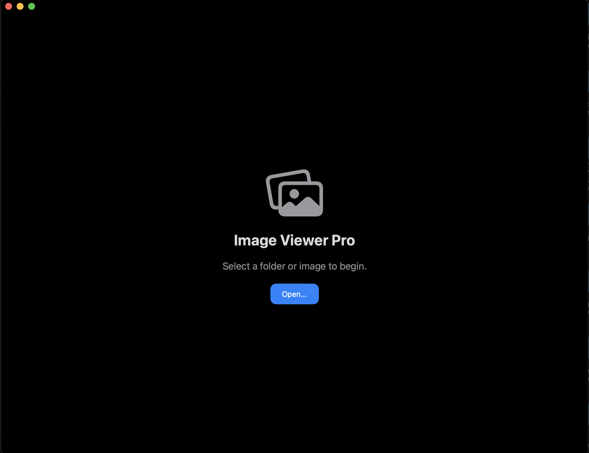
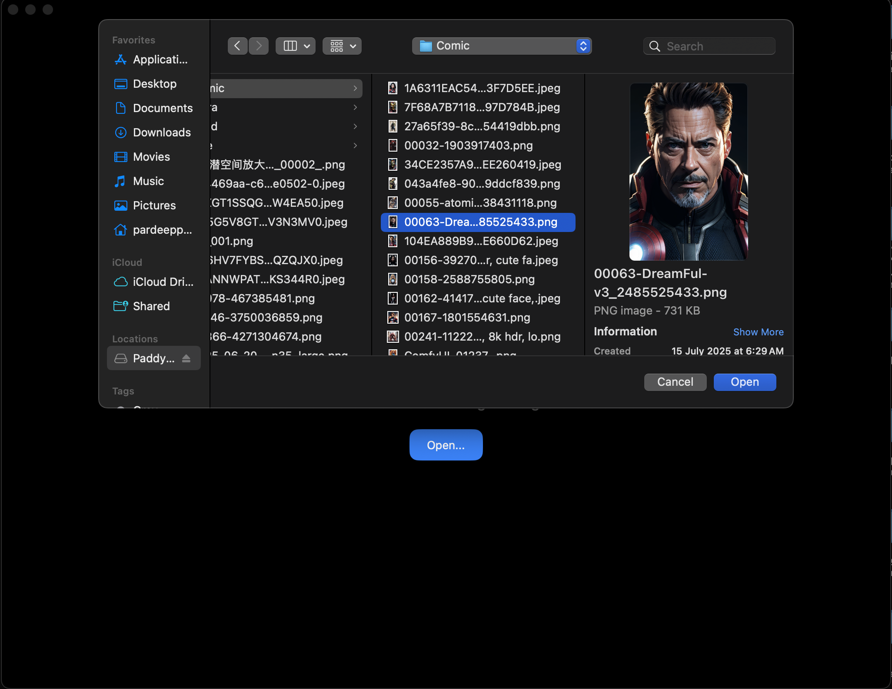
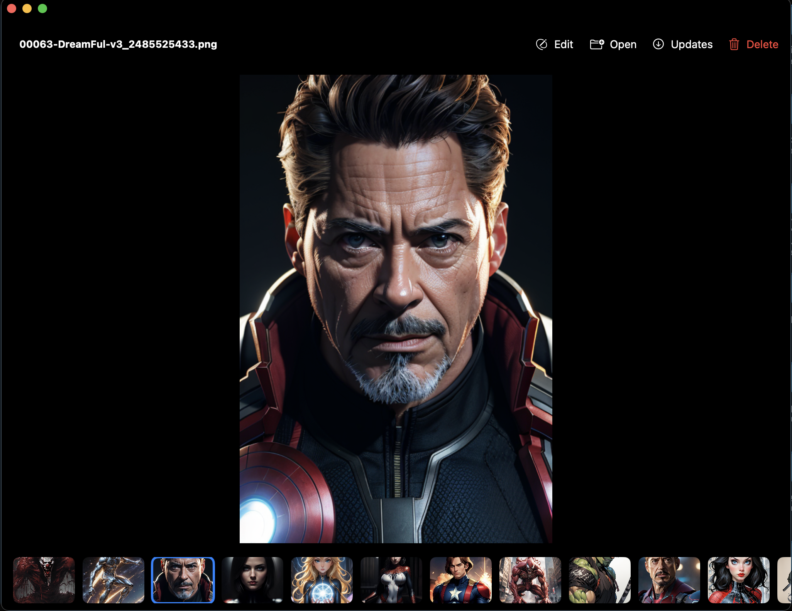
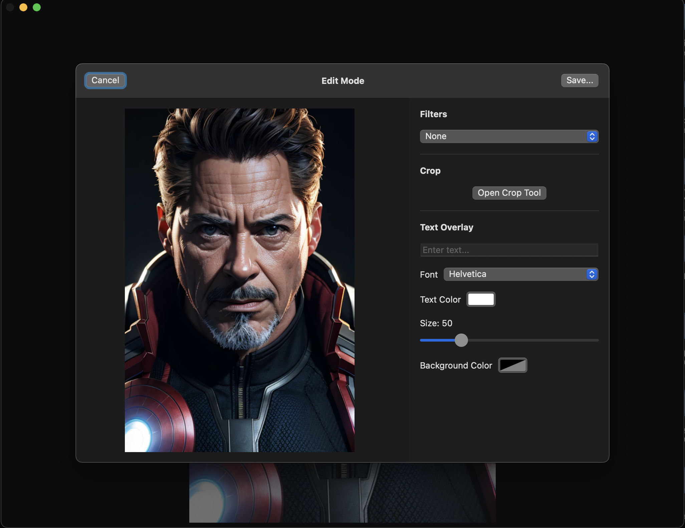

# 🖼️ ImageViewerPro for macOS

**ImageViewerPro** is a fast, modern, and feature-rich image viewer and editor built for macOS using **SwiftUI** and **AppKit**.  
Designed for creators, photographers, and anyone who works with images, it offers fullscreen viewing, editing, text overlays, and stunning filters — all in one intuitive interface.

---

## ✨ Features

- ✅ Fullscreen image viewing experience
- ✅ Scroll through images using keyboard or mouse
- ✅ Delete images (moves to macOS system Trash)
- ✂️ Crop with draggable handles and pixel-precise control
- 🖊️ Add styled text overlays with custom fonts, sizes, and colors
- 🎨 Apply CoreImage filters like:
  - Sepia, Noir, Comic, Bloom, Blur, X-Ray, and more
- 💾 Save as new or overwrite the existing image
- 🚀 Fast performance with large folders

---

## 📸 Screenshots

> Actual UI previews from the macOS app

### Main Interface


### Browse Image


### Full Screen View


### Edit Tools



---

## 🧠 Built With

- SwiftUI + AppKit
- CoreImage Framework
- Xcode on macOS 12+

---

## 🛠️ Installation & Usage

1. Clone the repository:
    ```bash
    git clone https://github.com/pardeeppatel/ImageViewerPro.git
    cd ImageViewerPro
    ```

2. Open the Xcode project:
    ```bash
    open ImageViewerPro.xcodeproj
    ```

3. Build and run the app on macOS.

---

## 📦 Project Structure

| Folder/File                  | Purpose                                |
|-----------------------------|----------------------------------------|
| `Source/`                   | Swift source files                     |
| `Assets/`                   | Screenshots and icons                  |
| `ImageViewerPro.xcodeproj/` | Xcode project setup                    |
| `README.md`                 | Project overview                       |
| `LICENSE`                   | MIT License                            |

---

## 👨‍💻 Author

Developed by [**Pardeep Patel**](https://github.com/pardeeppatel)  
🔗 Project page: [ToolNPlay.com](https://ToolNPlay.com)

---

## 🔗 Project Listings

- 🌐 Featured on: [ToolNPlay.com](https://ToolNPlay.com)
- 🚀 Powered by: [GetProjects.org](https://getprojects.org)
- 🔁 Community Fork: [@getprojectsIdea/ImageViewerPro](https://github.com/getprojectsIdea/ImageViewerPro)

---

## 🧑‍🎓 Learn & Reuse

This project is shared open-source to help others learn SwiftUI, CoreImage, and real-world macOS app development.  
You're welcome to fork it, modify it, or build your own version.

---

## 📄 License

This project is licensed under the MIT License — see the [LICENSE](LICENSE) file for details.

---

## 🤝 Contributions

Pull requests are welcome! To contribute:

1. Fork this repository
2. Create a new branch (`feature/your-feature`)
3. Commit your changes
4. Push the branch
5. Open a pull request 🚀

---

## 💬 Feedback

Have suggestions, feedback, or just want to say thanks?  
Open an issue here or visit [ToolNPlay.com](https://ToolNPlay.com)

---

[](https://getprojects.org/project/imageviewerpro)


